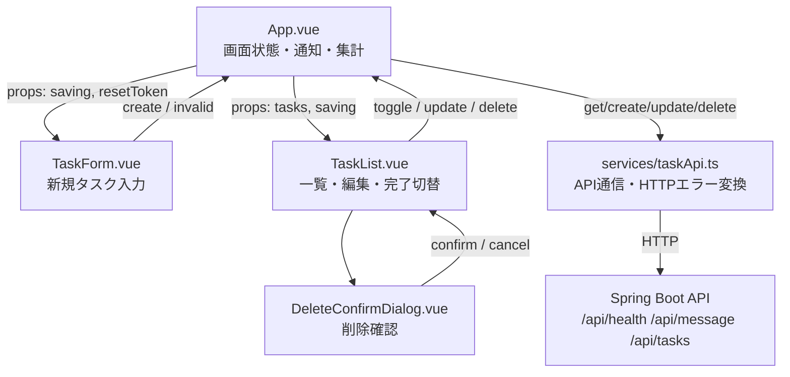
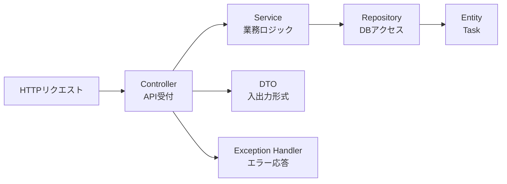

# spring-vue

Spring Boot + Vue の CRUD サンプルです。ローカル開発では H2、Docker Compose では PostgreSQL を使う構成にしています。

## 構成

- `backend/`: Spring Boot API
- `frontend/`: Vue 3 + Vite SPA
- `compose.yml`: PostgreSQL、Backend、Frontend をまとめて起動する Docker Compose 設定

## Frontend構成

### UIコンポーネント構成

Frontendは、`App.vue`が画面全体の状態と通知を管理し、入力・一覧・削除確認を子コンポーネントへ委譲する構成です。子コンポーネントからの操作イベントを`App.vue`が受け取り、API処理後に一覧を更新します。



### ファイル構成と責務

```text
frontend/
├── src/
│   ├── App.vue                         # 画面全体の状態管理と子コンポーネント連携
│   ├── main.ts                         # Vueアプリケーションの起動
│   ├── style.css                       # 画面全体のスタイル
│   ├── components/
│   │   ├── TaskForm.vue                # 新規タスク入力・入力イベント
│   │   ├── TaskForm.test.ts            # TaskForm単体テスト
│   │   ├── TaskList.vue                # 一覧・編集・完了切替・削除操作
│   │   ├── TaskList.test.ts            # TaskList単体テスト
│   │   ├── DeleteConfirmDialog.vue     # 削除確認ダイアログ
│   │   └── DeleteConfirmDialog.test.ts # ダイアログ単体テスト
│   └── services/
│       ├── taskApi.ts                  # API通信・型定義・HTTPエラー変換
│       └── taskApi.test.ts             # APIクライアント単体テスト
├── e2e/                                # Playwright E2Eテスト
├── Dockerfile                          # Docker版Frontendイメージ
├── package.json                        # npmスクリプトと依存関係
└── vite.config.ts                      # Vite・Vitest・API Proxy設定
```

責務の分離方針:

- `App.vue`: API処理の結果、通知、一覧、集計値など画面全体の状態を管理
- `components/`: ユーザー操作と表示を担当し、APIの詳細を直接持たない
- `services/taskApi.ts`: Backend APIとの通信とHTTPエラーの共通変換を担当

### Backendファイル構成

Spring Boot Backendは、Controller・Service・Repository・Entity・DTO・例外処理・設定をパッケージごとに分離しています。

```text
backend/
├── src/
│   ├── main/
│   │   ├── java/com/example/springvuebackend/
│   │   │   ├── SpringVueBackendApplication.java  # Spring Bootアプリケーション起動
│   │   │   ├── config/
│   │   │   │   ├── AppProperties.java            # 独自設定値のバインディング
│   │   │   │   ├── DataInitializer.java          # 初期データ投入
│   │   │   │   └── WebConfig.java                # CORSなどWeb設定
│   │   │   ├── controller/
│   │   │   │   ├── ApiController.java            # ヘルスチェック・メッセージAPI
│   │   │   │   └── TaskController.java           # タスクCRUD API
│   │   │   ├── dto/
│   │   │   │   ├── HealthResponse.java           # ヘルスチェック応答
│   │   │   │   ├── MessageResponse.java          # メッセージ応答
│   │   │   │   ├── TaskRequest.java               # タスク登録・更新リクエスト
│   │   │   │   └── TaskResponse.java              # タスク応答
│   │   │   ├── entity/
│   │   │   │   └── Task.java                     # JPAタスクエンティティ
│   │   │   ├── exception/
│   │   │   │   ├── ApiExceptionHandler.java      # API例外の共通変換
│   │   │   │   └── ResourceNotFoundException.java# リソース未検出例外
│   │   │   ├── repository/
│   │   │   │   └── TaskRepository.java           # TaskのDBアクセス
│   │   │   └── service/
│   │   │       └── TaskService.java              # タスク業務ロジック
│   │   └── resources/
│   │       └── application.yml                  # DB・サーバー・独自設定
│   └── test/java/com/example/springvuebackend/
│       ├── SpringVueBackendApplicationTests.java # コンテキスト起動テスト
│       └── controller/
│           ├── ApiControllerTest.java            # API状態・メッセージテスト
│           └── TaskControllerTest.java           # タスクCRUD・入力検証テスト
├── .mvn/wrapper/                                 # Maven Wrapper設定
├── Dockerfile                                    # Backend Dockerイメージ
├── mvnw / mvnw.cmd                               # Maven Wrapper実行スクリプト
└── pom.xml                                       # Maven依存関係・ビルド設定
```

Backendの処理は、次の流れで分担します。



## 使用ソフトウェア

### ローカル検証済み環境

- OS: Windows 11
- Java: Eclipse Adoptium Temurin OpenJDK 21.0.9 LTS
- Maven: Apache Maven 3.9.16
- Maven Wrapper: Apache Maven 3.9.11
- Node.js: v22.23.2
- npm: 12.0.2

### Backend

- Java: 21
- Spring Boot: 4.1.1
- Spring Framework: 7.0.9
- Embedded Tomcat: 11.0.24
- Hibernate ORM: 7.4.5.Final
- H2 Database: 2.4.240
- PostgreSQL JDBC Driver: 42.7.13
- Build tool: Maven Wrapper（Maven 3.9.11）
- Spotless Maven Plugin: 2.44.4
- google-java-format: 1.25.2
- ArchUnit: 1.4.1（テストスコープ）

直接利用している Spring Boot starter:

- `spring-boot-starter-web`
- `spring-boot-starter-data-jpa`
- `spring-boot-starter-validation`
- `spring-boot-starter-test`

直接利用しているSpring Boot starter以外の依存関係:

- `com.h2database:h2`（runtime）: ローカル起動とテスト用のインメモリDB
- `org.postgresql:postgresql`（runtime）: Docker Compose用PostgreSQL JDBCドライバ
- `spring-boot-configuration-processor`（optional）: `application.yml`の独自プロパティメタデータ生成

### Frontend

- Vue: 3.5.42
- Vite: 8.2.2
- TypeScript: 5.9.3
- `@vitejs/plugin-vue`: 6.0.8
- `@vue/tsconfig`: 0.8.1
- Vitest: 5.0.0
- `@vue/test-utils`: 2.5.0
- happy-dom: 20.14.0
- `vue-tsc`: 3.3.11
- ESLint: 10.10.0
- `@eslint/js`: 10.0.1
- `typescript-eslint`: 8.70.0
- `eslint-plugin-vue`: 10.11.0
- `eslint-config-prettier`: 10.1.8
- Prettier: 3.9.6

### Docker / Compose

このリポジトリには Docker 用ファイルを含めています。`DOCKER_HOST=tcp://127.0.0.1:2375` を指定した状態で `docker compose up --build` の起動確認まで完了しています。

確認済み Docker 関連ソフトウェア:

- Docker CLI: 29.7.2
- Docker daemon: 29.1.3
- Docker Compose plugin: v5.5.1
- Docker daemon接続先: `tcp://127.0.0.1:2375`

過去に発生した Frontend image build 失敗時のエラー:

```text
npm error network read ECONNRESET
```

Compose / Dockerfile で指定しているイメージ:

- PostgreSQL: `postgres:17-alpine`
- Backend build: `maven:3.9.11-eclipse-temurin-21`
- Backend runtime: `eclipse-temurin:21-jre`
- Frontend runtime: `node:22-alpine`

## Runtime

### 非Docker起動版

- Frontend: `http://localhost:5173`
- Backend: `http://localhost:8080`
- Vite proxy: `/api` -> `http://localhost:8080`（FrontendもホストOS上で起動する場合）
- Database: H2 in-memory

### Docker起動版

- Frontend: `http://localhost:5173`
- Backend: `http://localhost:8080`
- PostgreSQL: `localhost:5432`
- Vite proxy in container: `/api` -> `http://backend:8080`（Compose内のBackend）

Backendを非Dockerで起動し、FrontendだけをDockerで起動する場合は、Compose内の`backend`へ接続できないため502になります。その構成では`VITE_API_PROXY_TARGET=http://host.docker.internal:8080`への変更が必要です。

PostgreSQL 接続情報:

- Database: `springvuedb`
- User: `springvue`
- Password: `springvue`
- JDBC URL in backend container: `jdbc:postgresql://db:5432/springvuedb`

## 起動手順

### 非Docker起動版

BackendをホストOS上で起動します。

```powershell
cd backend
.\mvnw.cmd spring-boot:run
```

別のターミナルでFrontendをホストOS上から起動します。

```powershell
cd frontend
npm install
npm run dev
```

この構成ではFrontendのVite Proxyが`http://localhost:8080`へ接続し、BackendはH2を使用します。

### Docker起動版

Docker daemonを起動し、リポジトリルートから実行します。

```powershell
$env:DOCKER_HOST = "tcp://127.0.0.1:2375"
docker compose up -d --build
```

この構成ではFrontend・Backend・PostgreSQLがDocker Compose内で動作します。FrontendのVite Proxyは`http://backend:8080`へ接続します。

## テスト実行

### Backend

`backend/pom.xml` は Java 21 指定です。通常PATHが Java 21 の場合は、そのまま実行できます。

```powershell
cd backend
.\mvnw.cmd test
```

Spotlessを含むCI相当のBackend検査を実行する場合:

```powershell
cd backend
.\mvnw.cmd --batch-mode verify
```

確認範囲:

- Spring Bootコンテキスト起動
- `GET /api/health`
- `GET /api/message`
- `POST /api/tasks`
- `GET /api/tasks`
- `GET /api/tasks/{id}`
- `PUT /api/tasks/{id}`
- `DELETE /api/tasks/{id}`
- 必須タイトルのバリデーションエラー
- 存在しないタスクIDの404
- ArchUnitによるController・Service・Repository・DTOの依存方向

### Frontend

```bash
cd frontend
npm run test
npm run format:check
npm run lint
npm run typecheck
npm run build
```

コードを整形する場合は`npm run format`を実行します。`npm run format:check`はPrettier差分を検出し、`npm run lint`はESLintとVue/TypeScript向けルールを検査します。

Frontendの`App.vue`とUIコンポーネントから`fetch`を直接呼び出すこともESLintで禁止し、API通信を`src/services/taskApi.ts`へ集約します。

確認範囲:

- 初期表示でAPI状態、システムメッセージ、タスク一覧を表示すること
- 新規タスク追加後に成功通知と一覧反映が行われること
- 再読込時にシステムメッセージを表示し、エラー・成功通知を非表示にすること

### E2E

PlaywrightでDocker Compose上のFrontendをブラウザから操作し、タスクCRUD、再読込時の通知制御、入力・API・通信エラーを確認します。テストは共有DB上のデータ混入を防ぐため1Workerで直列実行し、主要なイベント・アクション後およびテストデータ後処理後のスクリーンショットをHTMLレポートへ添付します。

```powershell
$env:DOCKER_HOST = "tcp://127.0.0.1:2375"
docker compose up -d --build

cd frontend
npx playwright install chromium
npm run test:e2e
```

UIモードで実行する場合:

```powershell
npm run test:e2e:ui
```

テストレポートを表示する場合:

```powershell
npm run test:e2e
npm run test:e2e:report
```

`npm run test:e2e` の実行時に `frontend/playwright-report/` が生成されます。`npm run test:e2e:report` は、生成済みのHTMLレポートをブラウザで開くコマンドです。テストを先に実行せず、レポートだけを表示することはできません。

テスト終了後:

```powershell
cd ..
docker compose down
```

## CI

GitHub Actions 用のCI設定を `.github/workflows/ci.yml` に追加しています。

実行タイミング:

- `main` ブランチへのpush
- `main` ブランチ向けpull request
- 手動実行 `workflow_dispatch`

実行内容:

- Backend: Java 21 / Maven cache / `bash ./mvnw --batch-mode verify`（Maven 3.9.11、Spotless検査を含む）
- Frontend: Node.js 22 / npm cache / `npm ci`
- Frontend: `npm run format:check`
- Frontend: `npm run lint`
- Frontend: `npm run test`
- Frontend: `npm run typecheck`
- Frontend: `npm run build`
- E2E: Playwright Chromium / Docker Compose起動後にBackendの`/api/health`とFrontendを待機して `npm run test:e2e`

### ローカルCI実行（act）

GitHub ActionsのWorkflowをローカルで実行する場合は、先に`act`をインストールします。実行スクリプトはGit Bash、Linux、macOSで利用できるシェルスクリプトです。

```bash
winget install nektos.act
```

Docker CLIとDocker daemonを起動した状態で、リポジトリルートから実行します。

```bash
chmod +x scripts/run-ci-local.sh
./scripts/run-ci-local.sh
```

実行権限を付与できない場合は、`sh scripts/run-ci-local.sh` の形式でも実行できます。

ジョブ単位で実行する場合:

```bash
./scripts/run-ci-local.sh backend
./scripts/run-ci-local.sh frontend
```

このスクリプトは、`.github/workflows/ci.yml` の`push`イベントを`act`で再現します。Frontendジョブでは、依存関係、型チェック、ビルド、Docker Compose起動、Playwright E2Eまで実行します。

初回実行では、`catthehacker/ubuntu:act-latest`のRunnerイメージ、Java/Node.js環境、Playwrightブラウザなどのダウンロードに時間がかかります。

## API仕様書

- [Backend API仕様書](docs/backend-api.md)
- [Frontend API連携仕様書](docs/frontend-api.md)

## Docker操作

`docker` が PATH に通っている場合:

```bash
export DOCKER_HOST=tcp://127.0.0.1:2375
docker compose up --build
```

PowerShell の場合:

```powershell
$env:DOCKER_HOST = "tcp://127.0.0.1:2375"
docker compose up --build
```

PATH に通っていない場合:

```powershell
$env:DOCKER_HOST = "tcp://127.0.0.1:2375"
C:\docker\docker.exe compose up --build
```

停止:

```bash
docker compose down
```

DB ボリュームも削除する場合:

```bash
docker compose down -v
```

## API

- `GET /api/health`
- `GET /api/message`
- `GET /api/tasks`
- `GET /api/tasks/{id}`
- `POST /api/tasks`
- `PUT /api/tasks/{id}`
- `DELETE /api/tasks/{id}`

`POST /api/tasks` / `PUT /api/tasks/{id}` のリクエスト例:

```json
{
  "title": "Example task",
  "description": "Optional description",
  "completed": false
}
```

## DB 設定

通常のローカル起動とBackendテストでは、外部DBを必要としないH2インメモリDBを使います。`SPRING_DATASOURCE_*` 環境変数を指定すると、同じSpring BootアプリケーションをPostgreSQLへ切り替えられます。Docker Composeではこれらの環境変数を設定済みです。

- `SPRING_DATASOURCE_URL`
- `SPRING_DATASOURCE_DRIVER_CLASS_NAME`
- `SPRING_DATASOURCE_USERNAME`
- `SPRING_DATASOURCE_PASSWORD`
- `SPRING_JPA_HIBERNATE_DDL_AUTO`
- `APP_CORS_ALLOWED_ORIGIN`

デフォルトのローカルDB設定:

- JDBC URL: `jdbc:h2:mem:springvuedb;MODE=PostgreSQL;DB_CLOSE_DELAY=-1;DATABASE_TO_UPPER=false`
- Driver: `org.h2.Driver`
- DDL mode: `create-drop`

したがって、H2は削除されておらず、ローカル開発・Backendテストで現在も使用しています。一方、Docker ComposeのBackendはPostgreSQL JDBC URLと`ddl-auto=update`を受け取ります。

Docker Compose では以下の値を backend に渡しています。

- `SPRING_DATASOURCE_URL=jdbc:postgresql://db:5432/springvuedb`
- `SPRING_DATASOURCE_DRIVER_CLASS_NAME=org.postgresql.Driver`
- `SPRING_DATASOURCE_USERNAME=springvue`
- `SPRING_DATASOURCE_PASSWORD=springvue`
- `SPRING_JPA_HIBERNATE_DDL_AUTO=update`
- `APP_CORS_ALLOWED_ORIGIN=http://localhost:5173`

## 検証状況

実施済み:

- `backend/mvnw.cmd test`: 成功
- `npm install`: 成功
- `npm run test`: 成功
- `npm run typecheck`: 成功
- `npm run build`: 成功
- GitHub Actions CI設定: 追加済み、Backendテスト成功確認済み
- Maven Wrapper: `backend/mvnw` の実行権限 `100755` を確認済み
- Backend API CRUD: ローカル H2 で疎通確認済み
- Frontend dev server: HTTP 200 応答確認済み
- `C:\docker\docker.exe --version`: 成功
- `C:\docker\docker.exe compose version`: 成功
- `C:\docker\docker.exe compose config`: 成功
- `docker compose up --build`: 成功
- Compose containers: `db` healthy、`backend` up、`frontend` up
- `curl.exe http://localhost:8080/api/health`: 成功
- `curl.exe http://localhost:8080/api/tasks`: 成功
- `curl.exe -I http://localhost:5173`: HTTP 200
- `curl.exe http://localhost:5173/api/health`: 成功
- `curl.exe http://localhost:5173/api/tasks`: 成功

未実施:

- なし

## 注意点

- H2 はインメモリ DB のため、通常のローカル起動ではアプリ再起動時にデータが消えます。
- Docker Compose では PostgreSQL volume `postgres-data` を使うため、`docker compose down` だけでは DB データは残ります。
- 開発用の DB パスワードを `springvue` に固定しています。本番利用前に secrets 管理へ切り替えてください。
- `SPRING_JPA_HIBERNATE_DDL_AUTO=update` は開発向けです。本番相当では Flyway または Liquibase の導入を検討してください。
- `buildx Docker CLI plugin not found` の警告は、今回の Dockerfile では致命的ではありません。BuildKit 専用機能を使う場合は buildx plugin を追加してください。
- Frontend image build が `npm ci` のネットワークエラーで失敗する場合は、時間を置いて `docker compose build frontend` または `docker compose up --build` を再実行してください。
- Docker daemon が named pipe で見つからない場合は、`DOCKER_HOST=tcp://127.0.0.1:2375` を設定してから Docker コマンドを実行してください。
